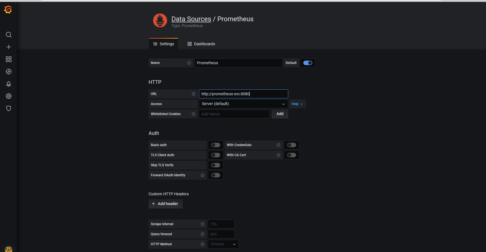
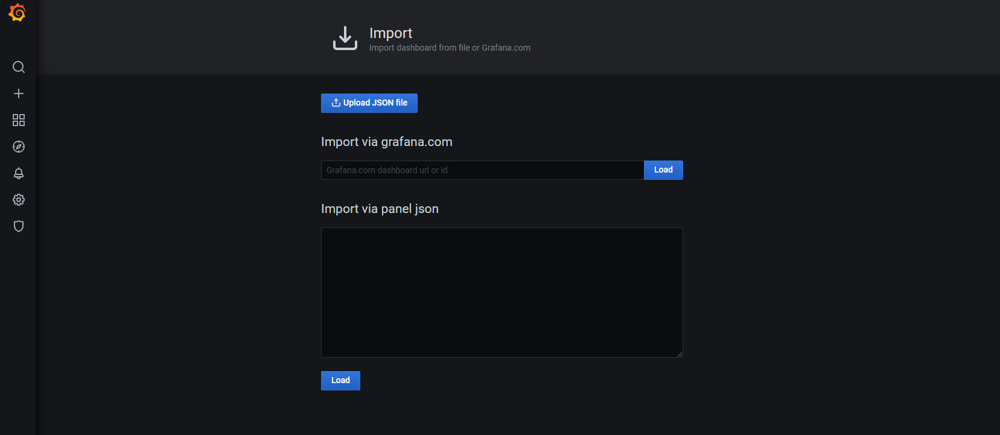
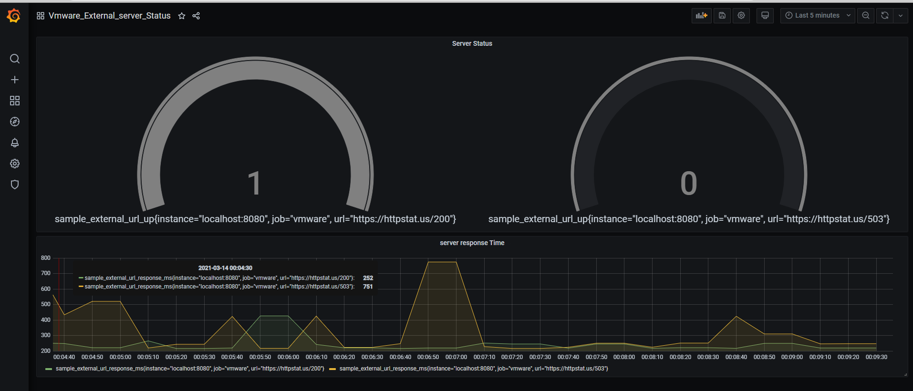

# ENDPOINT METRICS COLLECTOR

The above project is designed to poll endpoints and produce prometheus formatted metrics.

It produces the endpoint URL is up or down based on the status code and also the response time for the same.

## Installation instructions

### Docker Based Image build from Source

    `docker build -t <imagename>:<tag> vmware/`

## Kubernetes deployment
### Pre-requisites
For Kubernetes based installation
1. kubernetes 1.16+ version

### Instruction

Apply the Manifest

    `kubectl apply -f k8s_manifests/metrics_collector -n <namespace>`

Verify that all pods are up and running

    `kubectl get po -n <namespace>`

#### Prometheus deployment instructions

    `kubectl apply -f k8s_manifests/prometheus`

#### Grafana deployment instructions
    `kubectl create deployment grafana -n monitoring --image=docker.io/grafana/grafana:latest`
    `kubectl -n monitoring expose deployment grafana --type="NodePort" --port 3000`

_To access Grafana UI get the port number from the following command and use one of the nodes routable IP with port to access_
    
    `kubectl get svc -n monitoring`

If you have ingress-controller deployed then you can deploy the ingress modifying the domain name in the manifest file according to your needs.

    `kubectl apply -f k8s_manifest/grafana/grafana-ing.yaml`

Once the grafana UI is up and running, 
1. Login to UI using default username/password.
2. Create a new data source
    
   
3. Import the Dashboard located in k8s_manifest/grafana/dashboards
    

4. Once imported the data should be visible on dashboard
    

